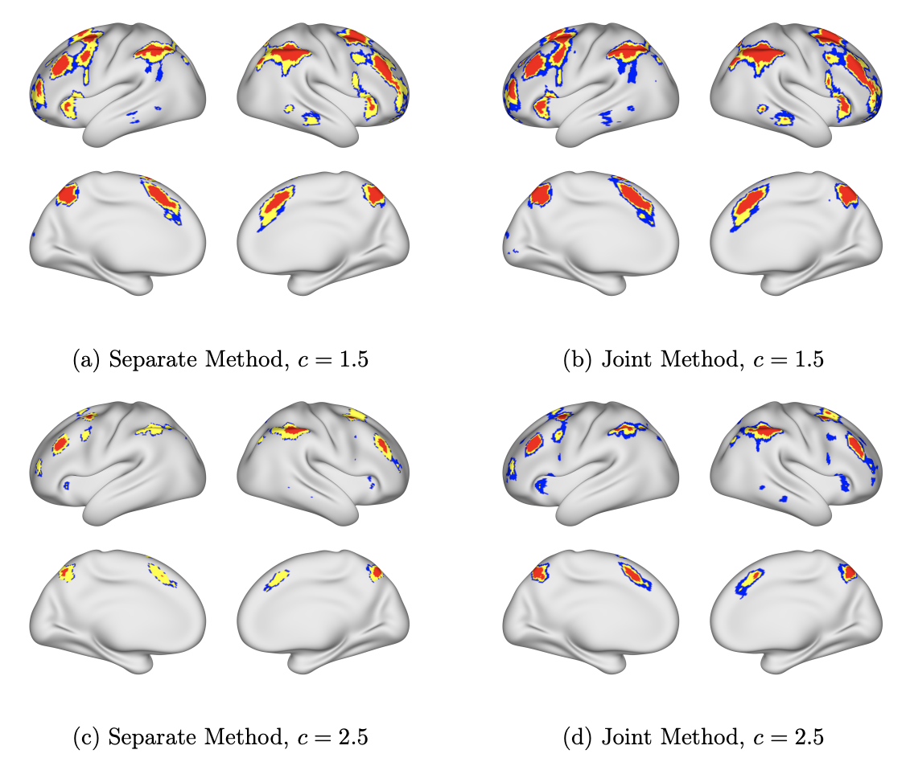

# Spatial Confidence Regions for Excursion Sets with False Discovery Rate Control
Python toolbox for FDR controlled confidence regions. The manuscript can be found [here](https://arxiv.org/abs/2504.13124).

- [Installation](#Installation)
- [Demonstration](#Demonstration)



## Installation
To use the `confidenceset` toolbox, run the following command directly to install the library.

```
pip install git+https://github.com/username/repository_name.git
```
Alternatively, You can set up the environment by installing the required dependencies:
```
pip install -r requirements.txt
```
The list of dependencies can be found in the [requirements.txt](https://github.com/HowonRyu/ConfidenceSet/blob/main/requirements.txt) file.


## Demonstration
The simulation demonstration is presented in [ConfidenceRegion_Demonstration.ipynb](https://github.com/HowonRyu/ConfidenceSet/blob/main/ConfidenceRegion_Demonstration.ipynb)


## Cite
Ryu, H., Maullin-Sapey, T., Schwartzman, A., & Davenport, S. (2025). Spatial Confidence Regions for Excursion Sets with False Discovery Rate Control. arXiv preprint arXiv:2504.13124.
