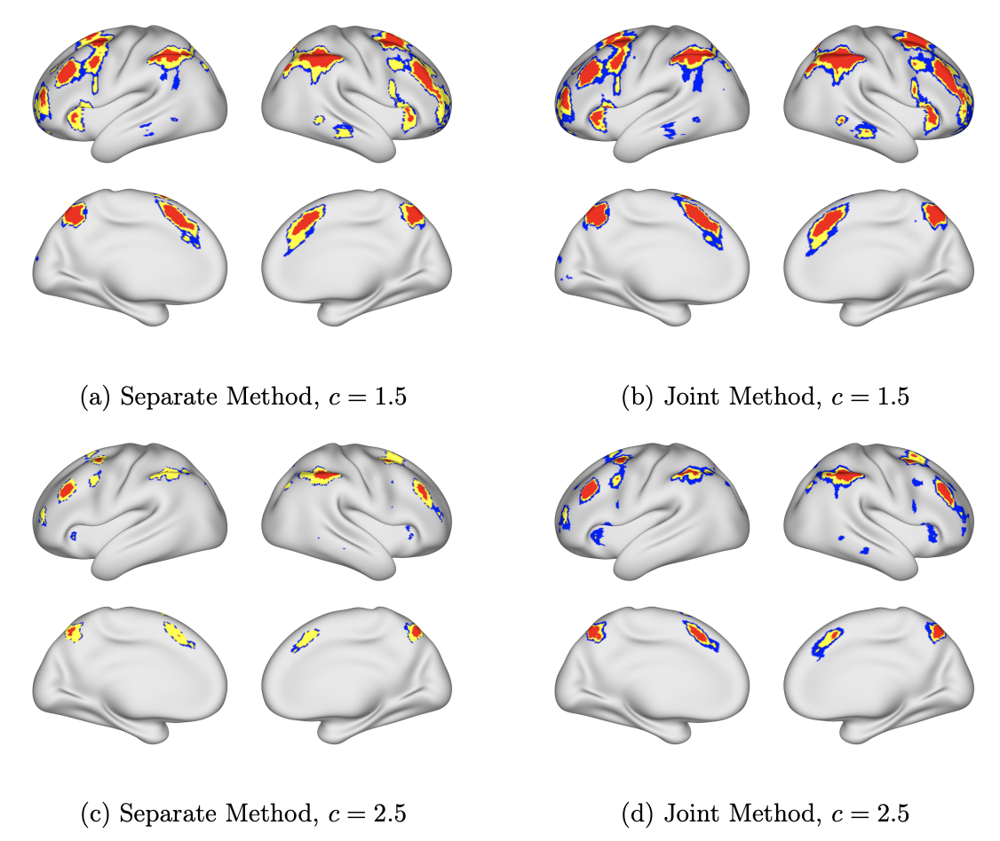

# Spatial Confidence Regions for Excursion Sets with False Discovery Rate Control
Python toolbox for FDR controlled confidence regions. The manuscript can be found [here](https://arxiv.org/abs/2504.13124).

- [Installation](#Installation)
- [Demonstration](#Demonstration)



## Installation
To use the `confidenceset` toolbox, run the following command directly to install the library.

```
pip install git+https://github.com/HowonRyu/ConfidenceSet.git
```

Alternatively, clone the repository and install locally:
```
git clone https://github.com/HowonRyu/ConfidenceSet.git
cd ConfidenceSet
pip install -e 
```

## Demonstration
The simulation demonstration is presented in [ConfidenceRegion_Demonstration.ipynb](https://github.com/HowonRyu/ConfidenceSet/blob/main/ConfidenceRegion_Demonstration.ipynb)


## Cite
Ryu, H., Maullin-Sapey, T., Schwartzman, A., & Davenport, S. (2025). Spatial Confidence Regions for Excursion Sets with False Discovery Rate Control. arXiv preprint arXiv:2504.13124.
